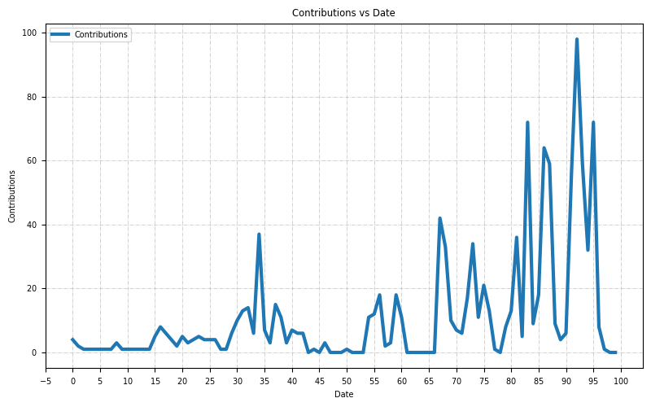

# Hello

I'm an Open Source Software maintainer and evangalist.

## Contact

- [e-mail](mailto:askb23@gmail.com)
- [Telegram]()

I spend my time working on OSS projects. If you liked any of
my contributions and my work helped you, sponsor me [ko-fi](https://ko-fi.com/askb23).

## Stats

Daily stats:

***Languages by contributions***

Shell, Java, Python, Makefile, JavaScript, HTML, Dockerfile, CSS, Perl, HCL, Groovy, Go, VimScript, TypeScript, ProtocolBuffer, PowerShell, Groff, C++, C#, C, Batchfile.

Number of contributions yesterday: **3**.

***Most popular***

- [myvagrantfiles](https://github.com/askb/myvagrantfiles)
- [Dockerfiles](https://github.com/askb/Dockerfiles)
- [scripts](https://github.com/askb/scripts)
- [releng-sandbox](https://github.com/opendaylight/releng-sandbox)
- [opendaylight.github.io](https://github.com/opendaylight/opendaylight.github.io)

***Recently starred***

- [developer-roadmap](https://github.com/kamranahmedse/developer-roadmap)
- [gerrymander](https://github.com/berrange/gerrymander)
- [app](https://github.com/dcoapp/app)
- [bermuda](https://github.com/agittins/bermuda)
- [homeassistant-blueprints](https://github.com/tykeal/homeassistant-blueprints)

***GITHUB Metrics***

