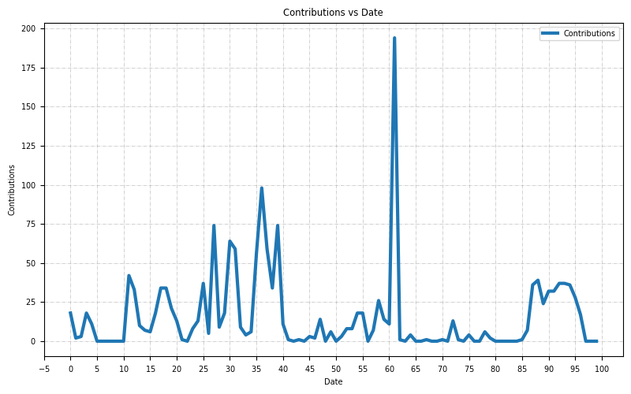

# 👋 Hey, I'm Anil (askb)

**Senior IT Engineer | Release Engineering • Infrastructure Automation • AI-Assisted Development**

---

## 🚀 About Me

Senior IT Engineer at **The Linux Foundation**, specializing in release engineering, cloud infrastructure automation, and developer tooling. I architect and maintain CI/CD pipelines that power some of the largest open source projects, focusing on scalability, reliability, and intelligent automation.

Currently building **AI-powered agentic workflows** across DevOps and home automation—from GitHub Copilot agentic CI/CD pipelines to smart home systems with AI health coaching, solar energy monitoring, and Garmin fitness tracking. Experimenting with LLM-assisted development to make infrastructure smarter and more autonomous.

When I'm not optimizing build systems or tinkering with smart home automations, you'll find me on two wheels (🚴 bicycle or 🏍️ motorcycle) or exploring trails on foot 🥾.

### 🔧 Core Competencies

- **Infrastructure Engineering** - Cloud platforms, container orchestration, distributed systems
- **Release & Deployment Automation** - CI/CD pipelines, automated testing, deployment strategies
- **Developer Experience** - CLI tools, APIs, workflow optimization, productivity automation
- **AI-Assisted Development** - LLM integration, agentic workflows, intelligent automation
- **Smart Home & IoT** - Home Assistant, energy monitoring, AI health coaching, Garmin fitness
- **Infrastructure as Code** - Declarative automation, configuration management, immutable infrastructure

---

## 🌟 Featured Projects

### 🔨 [OpenDaylight Release Engineering](https://github.com/opendaylight/releng-builder)
Complete CI/CD infrastructure for OpenDaylight—orchestrating automated builds, testing, and deployment across 60+ repositories.

**Impact:** Supports 100+ developers | 500K+ builds executed | 99.8% uptime

### 🐳 [Packer Build Action](https://github.com/askb/packer-build-action)
GitHub Action for automated cloud image building with secure bastion integration. Enables ephemeral infrastructure provisioning in CI pipelines.

**Tech:** GitHub Actions • Cloud Automation • Security

### 🛠️ [LF Release Engineering Actions](https://github.com/lfit/releng-reusable-workflows)
Suite of 40+ reusable GitHub Actions and workflows for the Linux Foundation ecosystem. Production-grade automation for multi-cloud deployments.

**Used by:** 50+ LF projects | 1000+ workflow runs/month

### ⚡ [LFTools](https://github.com/lfit/releng-lftools)
Python CLI tool for Linux Foundation infrastructure management—cloud resource orchestration, build automation, and developer utilities.

**Tech:** Python • CLI Development • API Integration

### 🤖 [AI Experiments](https://github.com/askb/ai-n8domata)
Exploring AI-assisted automation, LLM integration workflows, and intelligent tooling. Experimenting with n8n, vector databases, and AI agents.

**Status:** Active experimentation | Learning in public

### 🏠 [Smart Home Configuration](https://github.com/askb/askb-ha-config)
Home Assistant OS configuration featuring **GitHub Copilot agentic workflows**—automated daily health reports via GitHub Issues, AI-powered PR reviews for config validation, energy/solar monitoring (Fronius inverter, Wattpilot EV charger), multi-camera security with Frigate + Coral TPU object detection, and multi-user Garmin health coaching pipelines.

**Tech:** Home Assistant • Agentic Workflows • Frigate • Solar/EV Monitoring • Spec-Driven Development

### 💪 [Garmin Fitness Coach Addon](https://github.com/askb/ha-garmin-fitness-coach-addon)
Home Assistant addon for Garmin Connect data sync with AI-powered coaching dashboard. Multi-user health tracking with InfluxDB time-series storage and Grafana visualizations at `grafana.askb.dev`.

**Tech:** Python • Home Assistant Addon • InfluxDB • Grafana • AI Coaching

### 🏋️ [Garmin Fitness Coach App](https://github.com/askb/ha-garmin-fitness-coach-app)
AI-powered sport scientist web app—transforms Garmin health data into evidence-based coaching with personalized workout recommendations, diabetes tracking, and fitness analytics.

**Tech:** Next.js • TypeScript • tRPC • Drizzle ORM • AI/ML

---

## 💻 Tech Stack

### Languages & Scripting

### Infrastructure & Cloud

### CI/CD & Automation

### Smart Home & IoT

---

## 📊 GitHub Stats

### Daily Contribution Activity

### Overall Metrics

---

## 🌏 Open Source Contributions

Contributing across multiple Linux Foundation projects and communities:

- **OpenDaylight** - Release Engineering Lead
- **Linux Foundation IT** - Infrastructure Automation
- **OPNFV** - CI/CD Pipeline Development
- **FD.io** - Build System Maintenance

### Languages by Contribution Volume
Shell • Python • Java • Dockerfile • Makefile • TypeScript • JavaScript • Groovy • CSS • Go • PowerShell • Perl • Kotlin • Jinja • HTML • HCL • Dart

---

## 🤝 Let's Connect

I'm always interested in discussing:
- 🔧 Release engineering and deployment strategies
- 🐧 Infrastructure optimization and cloud architecture
- 🚀 CI/CD pipeline design and best practices
- 🤖 LLM integration and AI-assisted agentic workflows
- 🏠 Smart home automation, energy monitoring, and IoT
- 💪 Health tracking, Garmin fitness, and AI coaching
- 🌐 Open source community building and collaboration
- 🚴 Trail recommendations (tech conferences or bike trails!)

### How to Reach Me
- **Email:** [askb23@gmail.com](mailto:askb23@gmail.com)
- **Twitter/X:** [@askb23](https://twitter.com/askb23)
- **Keybase:** [askb](https://keybase.io/askb)
- **LinkedIn:** [abelur](https://linkedin.com/in/abelur)
- **Telegram:** *Available on request*

---

## ☕ Support My Work

If my open source contributions have helped you, consider buying me a coffee! Your support helps me dedicate more time to building tools that benefit the community.

---

### 💡 "Automating infrastructure by day, exploring trails by weekend"

*Last updated: Auto-generated via GitHub Actions • 2026-04-20 02:42 UTC*

