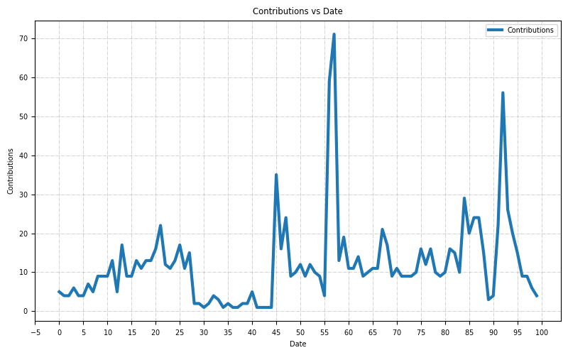

# Hello

I'm an Open Source Software maintainer and evangalist.

## Contact

- [e-mail](mailto:askb23@gmail.com)
- [Telegram]()

I spend my time working on OSS projects. If you liked any of
my contributions and my work helped you, sponsor me [ko-fi](https://ko-fi.com/askb23).

## Stats

Daily stats:

***Languages by contributions***

Shell, Python, Makefile, JavaScript, Java, HTML, Dockerfile, Go, VimScript, TypeScript, HCL, Groovy, CSS, C, Ruby, ProtocolBuffer, PowerShell, Perl, Groff, CMake, C++, Batchfile.

Number of contributions yesterday: **2**.

***Most popular***

- [myvagrantfiles](https://github.com/askb/myvagrantfiles)
- [Dockerfiles](https://github.com/askb/Dockerfiles)
- [scripts](https://github.com/askb/scripts)
- [github2gerrit](https://github.com/askb/github2gerrit)
- [opendaylight.github.io](https://github.com/opendaylight/opendaylight.github.io)

***Recently starred***

- [runner.server](https://github.com/ChristopherHX/runner.server)
- [gpt-engineer](https://github.com/AntonOsika/gpt-engineer)
- [just](https://github.com/casey/just)
- [ospology](https://github.com/todogroup/ospology)
- [github-actions-course-resources](https://github.com/academind/github-actions-course-resources)

